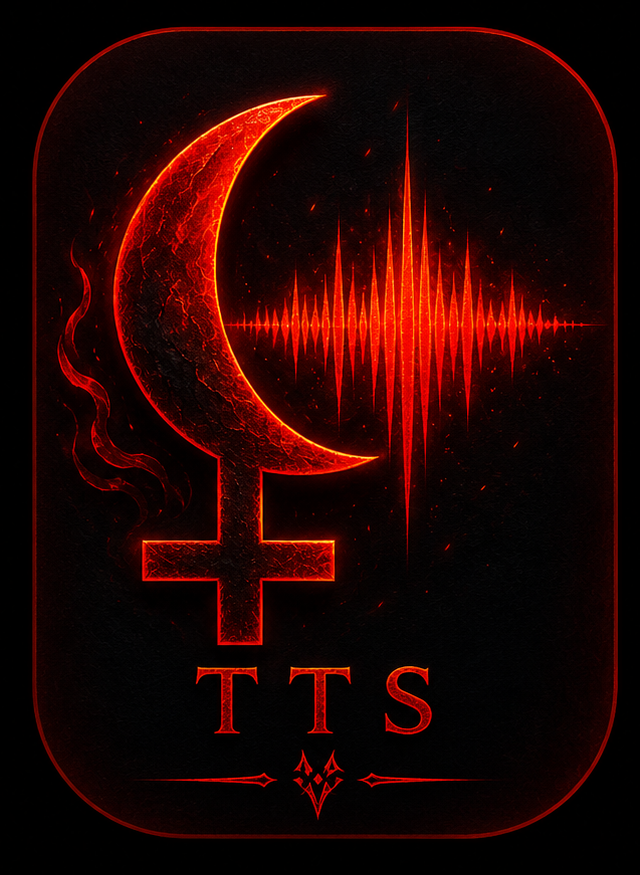

# Lilith-TTS 🌙

A high-performance, system-wide local Text-to-Speech application for Lilith Linux. 



## Features

- **NeuTTS Nano Integration**: Real-time high-quality TTS using the NeuTTS Nano model (~120MB GGUF).
- **Instant Voice Cloning**: Create new voices from 5–15 second clean WAV reference clips.
- **Global Hotkey**: Press `Ctrl+T+T+M` to read the current screen content or selection from any application.
- **Intelligent Screen Reader**: Uses AT-SPI2 to walk the accessibility tree, automatically skipping UI chrome, navigation bars, and advertisements.
- **Web-Optimized**: Heuristics to extract the main article content from browsers, ignoring sidebar clutter.
- **Panel GUI**: Sleek, borderless Iced-based popup for controls, speed, pitch, and voice management.
- **System Tray Integration**: Background daemon with StatusNotifierItem tray icon.

## Architecture

Lilith-TTS is built as a three-crate Rust workspace:

- **`tts-core`**: Shared library containing the TTS engine abstraction, configuration, audio playback logic, and screen/clipboard readers.
- **`tts-daemon`**: Background service that monitors global hotkeys, manages the TTS engine lifecycle, and provides a Unix socket IPC server.
- **`tts-gui`**: A borderless panel applet that provides a user interface to control the daemon and configure voices.

## Installation

### Method 1: Using the .deb Package (Recommended)

Build the Debian package:
```bash
./make_deb.sh
```

Install the package:
```bash
sudo dpkg -i target/debian/lilith-tts_0.1.0_amd64.deb
```

If you encounter dependency errors (e.g., missing `python3-pyatspi`), fix them with:
```bash
sudo apt-get install -f
```

### Method 2: Manual Installation (Development)

Run the included install script:
```bash
./install.sh
```

## Setup & Configuration

### 1. NeuTTS Model
Place the NeuTTS Nano model in the standard Lilith model directory:
```bash
sudo mkdir -p /var/lib/lilith/models
sudo wget -O /var/lib/lilith/models/neutts-nano-q4.gguf https://huggingface.co/neuphonic/neutts-nano-q4/resolve/main/neutts-nano-q4.gguf
```

### 2. Permissions
Your user must be in the `input` group to detect the global hotkey:
```bash
sudo usermod -aG input $USER
```
*(Log out and back in for changes to take effect)*

### 3. Start Services
Enable and start the background daemon:
```bash
systemctl --user daemon-reload
systemctl --user enable --now lilith-tts-daemon
```

Launch the GUI panel:
```bash
lilith-tts
```

## Usage

- **Global Hotkey**: `Ctrl + T + T + M` (Read Screen).
- **Manual Read**: Copy text to clipboard and click "📋 Clip" in the panel.
- **Voice Cloning**: Click "＋ Voice" in the panel, select a WAV sample, and name your new voice.

---
*Built for Lilith Linux — BlancoBAM*
